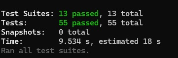
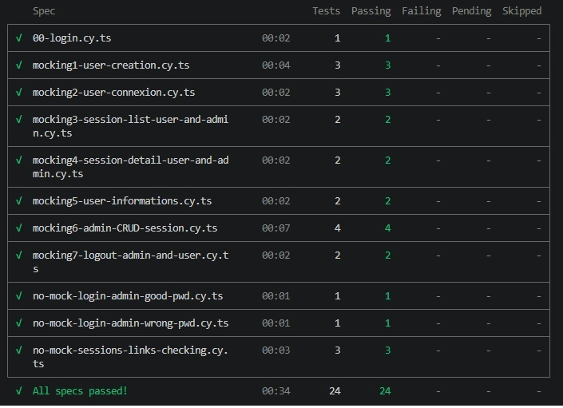
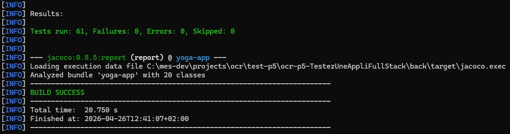
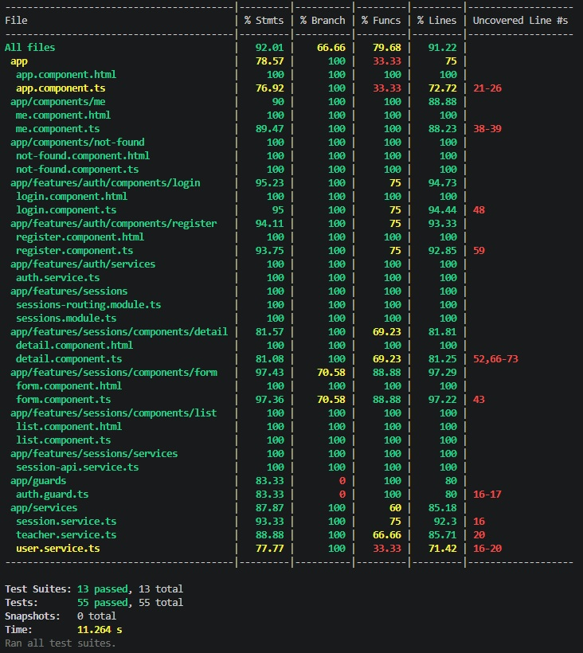
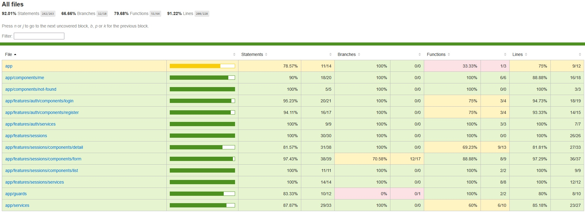
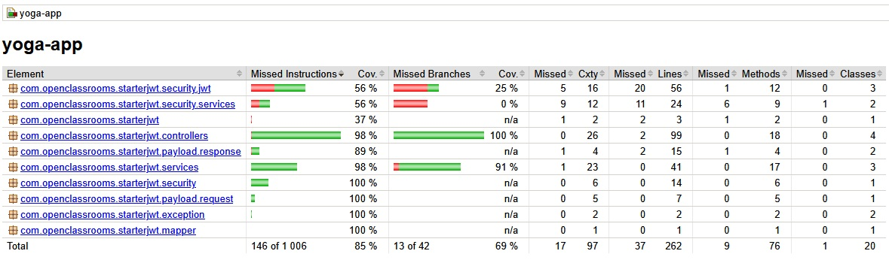

# Tests de l'application de gestion de cours de YOGA 
## Projet n°5 d'OCR tests en JEST, CYPRESS, JUNIT et MOCKITO

## SOMMAIRE : 
[Installation du projet](#installation-du-projet-)

[Exécution du projet](#execution-du-projet-)

[Tests du projet](#tests-du-projet-)

[Couverture des Tests du projet](#couverture-des-tests-du-projet-)

[Liste des soucis rencontrés](#liste-des-soucis-rencontrés)


## INSTALLATION du projet :
J'ai réalisé ce projet de test sous Visual Studio Code et sous windows
Pour installer l'environnement de développement, j'ai fait (dans l'ordre)
- Installation de nvm 1.1.12 (node version manager qui permet la gestion des versions de npm sur un poste)
  - ne pas installer la version 2.quelque chose elle : ne fonctionnait pas sous windows il y a quelques mois 
  - aller sur le site officiel [https://www.nvmnode.com/fr/guide/download.html](https://www.nvmnode.com/fr/guide/download.html)
  - verifier l'exe 
  - si ok executer l'exe
- Installation du jdk 11
  - aller chercher l'exe sur le site d'oracle [https://www.oracle.com/fr/java/technologies/downloads/#java11-windows](https://www.oracle.com/fr/java/technologies/downloads/#java11-windows)
    - vérifier l'exe
    - si ok exécuter l'exe
- Installation de maven 
  - aller chercher maven 3.9 sur le site officiel [https://maven.apache.org/download.cgi](https://maven.apache.org/download.cgi)
    - vérifier l'exe
    - si ok exécutez l'exe
- Installation de MySql 8.0.xxx 
    - aller chercher l'exe sur le site officiel [https://dev.mysql.com/downloads/installer/](https://dev.mysql.com/downloads/installer/)
        - vérifier l'exe
        - si ok exécuter l'exe
    - créer une connexion (se souvenir du mot de passe)
    - créer une base de données yoga (UTF8 UTF8_general_ci) (bouton + create a new schema in this connected server)
- Installation de visual studio code
  - aller sur le site officiel [https://code.visualstudio.com/download](https://code.visualstudio.com/download)
  - choisir windows
  - verifier l'exe
  - si ok executer
  + plugin 
    - Angular LanguageServices, 
    - Cypress Helper, 
    - Cypress Fixture Intellisense, 
    - Cypress snipets, 
    - Extention pack for Java, 
    - Maven for java, 
    - Language support for java
    - project manager for java
    - Spring boot Dashboard
    - Sprin boot extension pack
    - Spring boot tools
    - Spring initializr java support
    Test Runner for java
- Installation de git pour pusher mon code (mais pas que...)
  - récupérer le code [ici](https://github.com/franck-g75/ocr-p5-TestezUneAppliFullStack)
  - faire **git clone https://github.com/franck-g75/ocr-p5-TestezUneAppliFullStack **
  - puis faire **c**d ocr-p5-TestezUneAppliFullStack**
  - vérifier que le projet est bien géré dans git en tapant **git status**
  - git peut servir aussi à passer des lignes de commandes
- Installation spécifique au poste de développement
  - Modifier les variables d'environnements
  - créer JAVA_HOME à la racine de son répertoire d'installation
  - creer MAVEN_HOME à la racine de son répertoire d'installation
  - créer NVM_HOME à la racine de son répertoire d'installation
  - créer NVM_SYMLINK à la racine du répertoire d'installation de nodejs
  - modifier la variable systeme PATH en intégrant les 4 chemins ci dessus
    - ajouter %JAVA_HOME%\bin
    - ajouter %MAVEN_HOME%\bin
    - ajouter %NVM_HOME%
    - ajouter %NVM_SYMLINK%
  - copier coller script.sql de racine du projet\resources\sql vers un nouveau script de la base yoga précédemment installée
    - executer le script et vérifier qu'il n'y a pas d'erreur

- Installation spécifique au client : 
  - nvm install 16.10.0 ( n'importe où )
  - nvm use 16.10.0 ( n'importe où ) 
  - npm i -g @angular/cli@14.1.x dans un cmd à la racine du **front**
  - npm install dans un cmd à la racine du **front**
  
- vérifications du serveur
  - taper java -version pour vérifier que le JDK est bien installé (11.x.y)
  - taper mvn -v pour vérifier que maven est bien installé (3.9.x)

- vérification du client
  - taper nvm -v pour vérifier que nvm est bien installé (1.1.12)
  - taper nvm list pour lister les versions de npm installées et verifier qu'on est en 16.10
  - taper ng version pour voir la version d'angular installée

- ajout d'un répertoire resources dans /back/src/main
- creation d'un fichier application.properties contenant 9 lignes

```
spring.datasource.url=jdbc:mysql://localhost:3306/yoga?allowPublicKeyRetrieval=true
spring.datasource.username=????votre login de la base de donées????
spring.datasource.password=????votre mot de passe de la base de données????

spring.jpa.properties.hibernate.dialect=org.hibernate.dialect.MySQL5InnoDBDialect
spring.jpa.hibernate.naming.physical-strategy=org.hibernate.boot.model.naming.PhysicalNamingStrategyStandardImpl
spring.jpa.show-sql=true
oc.app.jwtSecret=openclassrooms
oc.app.jwtExpirationMs=86400000
```

## EXECUTION du projet :
Verifier quand meme que le démon de la base de données est lancé dans le gestionnaire des taches (chercher mysqld dans service)

Il faut lancer le serveur puis lancer le client avant de pouvoir ouvrir la page.
Pour ce faire, 
- Dans un cmd, executer la commande dans le repertoire **back** : **mvn spring-boot:run**
- Dans un autre cmd, executer la commande dans le répertoire **front** : **ng serve**
- vérifier qu'aucune erreur n'est levée
- Puis, dans un navigateur taper l'url : [http://localhost:4200](http://localhost:4200)
- login: yoga@studio.com
- password: test!1234

## TESTS du projet :

### JEST :
- arreter le client pour passer les tests
- installer un composant additionnel dans une cmd du répertoire front 
- npm install --save-dev jest jest-preset-angular@12.2.0
- taper la commande **npx jest** ou **npm run test** pour lancer les tests
- normalement 55 tests sont passés avec succès



### CYPRESS :
- redémarrer le client **ng serve** dans un cmd répertoire front
- taper **npx xypress run** pour lancer les tests end to end
- normalement 24 tests s'exécutent sans erreurs



### JAVA JUNIT MOCKITO

- arreter le serveur pour passer les tests (Ctrl C)
- taper **mvn clean test** pout passer tous les tests
- normalement 61 tests passent avec succès



## COUVERTURE DES TESTS du projet :

### JEST

Pour calculer le taux de couverture des tests JEST, il faut :

- taper la commande **npx jest --coverage**
- normalement, on obtient ces résultats



ou bien sur le site disponible à l'adresse ./front/coverage/jest/lcov-report/index.html



### CYPRESS

Pour calculer le taux de couverture des tests CYPRESS, il faut regarder le fichier excel :

Il existe 16 tests à faire dans le plan de test fourni par le sujet.

|**type de test**|**détail du test**|**nom fonction**|**Où**|**nb**|
|:-|:-|:-|:-:|:-:|
|login|La connexion|login + no-mock-login-admin-good-pwd + mocking2-user-connexion|cypress|5|
|login|La gestion des erreurs en cas de mauvais login|no-mock-login-admin-wrong-pwd|cypress|1|
|password|L’affichage d’erreur en l’absence d’un champ obligatoire|login.component|jest|2|
|register|La création de compte|mocking1-user-creation|cypress|3|
|register|L’affichage d’erreur en l’absence d’un champ obligatoire|register.component|jest|7|
|sessions|Affichage de la liste des sessions|mocking3-session-list-user-and-admin|cypress|1|
|sessions|L’apparition des boutons Create et Detail si l’utilisateur connecté est un admin|mocking3-session-list-user-and-admin|cypress|1|
|informations session|Les informations de la session sont correctement affichées|mocking4-session-detail-user-and-admin|cypress|1|
|informations session|Le bouton Delete apparaît si l'utilisateur connecté est un admin|mocking4-session-detail-user-and-admin|cypress|1|
|création session|La session est créée|mocking6-admin-CRUD-session|cypress|1|
|creation session|L’affichage d’erreur en l’absence d’un champ obligatoire|form.component|jest|5|
|suppression session|La session est correctement supprimée|mocking6-admin-CRUD-session|cypress|1|
|modification session|La session est modifiée|mocking6-admin-CRUD-session|cypress|1|
|modification session|L’affichage d’erreur en l’absence d’un champ obligatoire|form.component|jest|-|
|account|Affichage des informations de l’utilisateur|mocking5-user-informations|cypress|2|
|logout|La déconnexion de l’utilisateur|mocking7-logout-admin-and-user|cypress|2|
:test end to end

20 tests ont été réalisés sous cypress et 15 tests avaient déjà été réalisés sous jest.
Il existe 3 tests pour tester des liens (le premier tests réalisé) + 1 test de vulnerabilité XSS dans mocking6-admin-CRUD-session


### JAVA

Pour calculer le taux de couverture des tests java, il faut :
  
- arreter le serveur (Ctrl C)
- avoir au préalable configurer sur quel ensemble la couverture se base . **(déjà fait dans les sources)**
  - ajouter à la balise plugin du groupID org.jacocoo dans le POM.xml

  ```
  			<configuration>
					<excludes>
						<exclude>**/dto/**</exclude>
						<exclude>**/*MapperImpl.class</exclude>
					</excludes>
				</configuration>
  ```

  - ajouter un fichier longbok.config qui contiendra 

  ```
        # Disable Lombok for Jacoco
        lombok.addLombokGeneratedAnnotation = true
  ```

- exécuter les tests sans erreur en tapant **mvn clean test**
- visualiser le fichier ./back/target/site/index.html
- normalement 85% des tests sont réalisés




## Liste des soucis rencontrés
### Dans les sources :
- Le bouton supprimer l'utilisateur ne fonctionne pas (vu uniquement dans les tests de la page me)
- Les fonctions min et max n'existent pas il faut les remplacer par minLength et maxLength (corrigé)
- La base de données accepterai des users de meme email (pas de unique constraint sauf dans les sources de la table USERS) (en fait c'est géré dans le code)
- Il manque une fonction : comment un admin règle un user en admin
- J'ai vu des fonctions isEnabled, isAccountNonExpired, isAccountNonLocked et isCredentialNonExpired non implémentées retournent toujours true, est ce normal ? (La connexion se fait par un token. c'est surement pour ça)

### Dans la méthode
- Ce n'est pas très juste de remplir un pourcentage de tests.
  - certaines fois le testeur peut tester avec augmentation du pourcentage mais sans apport véritable au projet (dto).

### Dans la technique
- Très difficile de produire des rappports de couverture de tests cypress : 
  - Il faut instrumenter le code d'abord.
  - Cela ne semble pas prêt à être utilisé tel que.

### Dans la vie
- je me suis marié.


